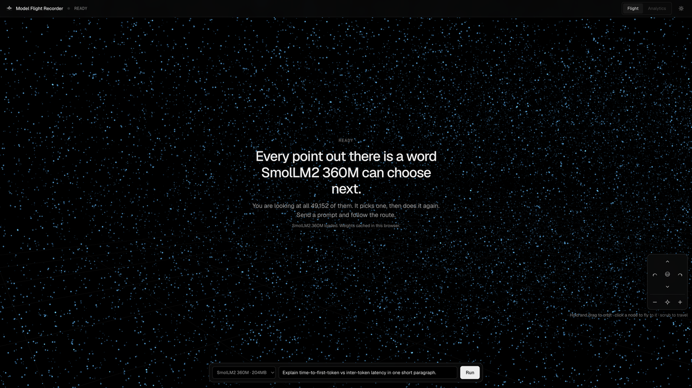
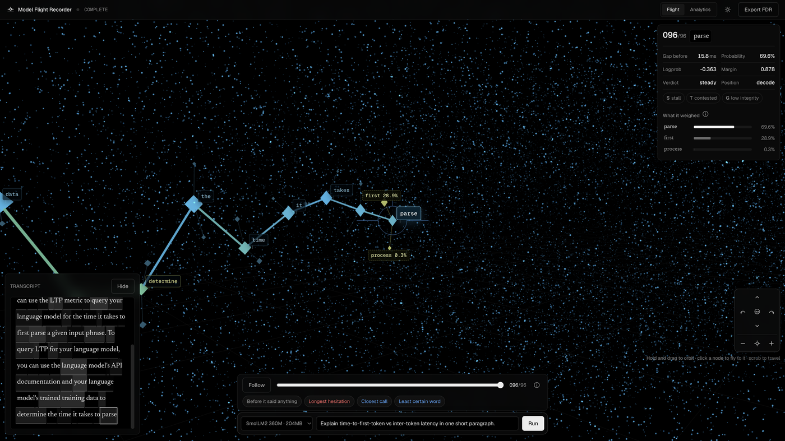
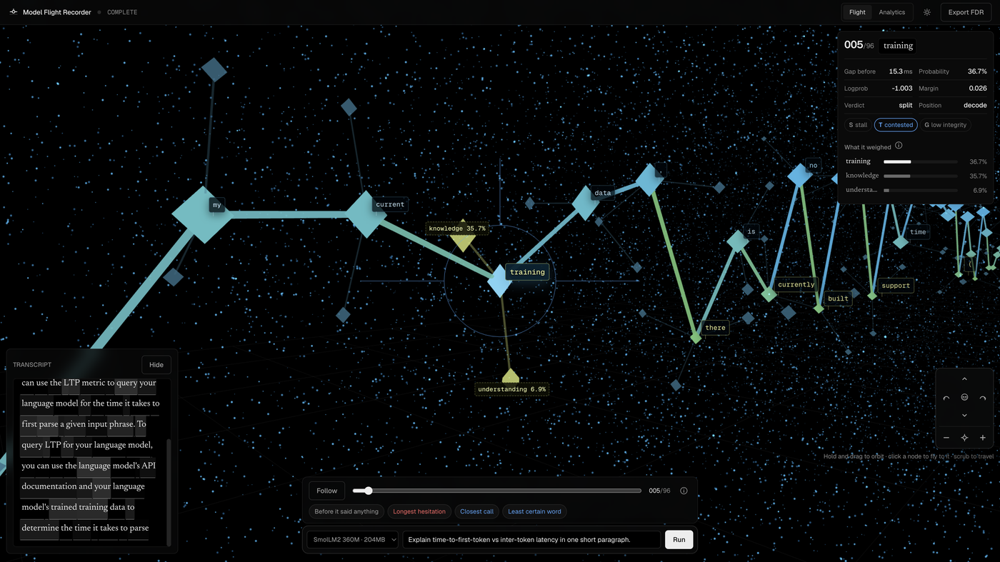
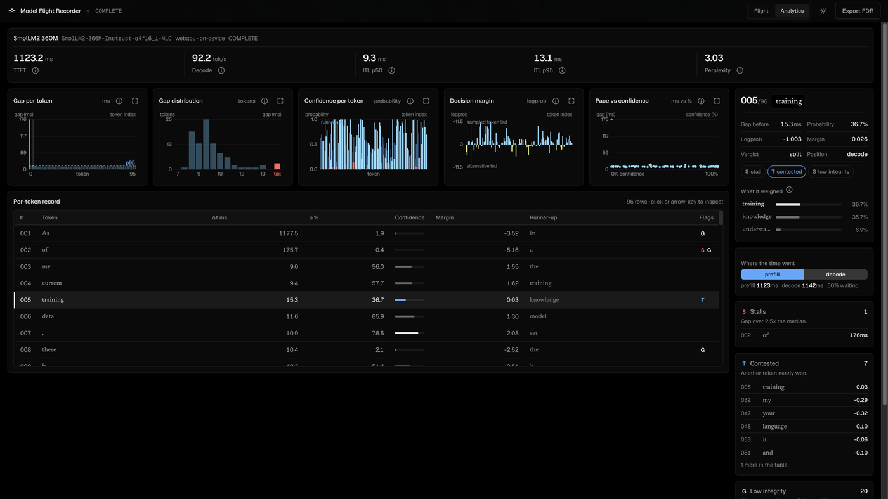
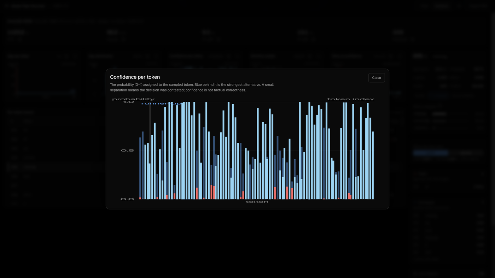
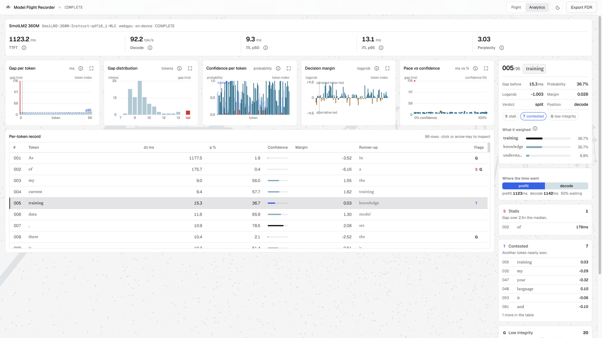

# Model Flight Recorder

A browser-local flight recorder for small language models.

You download a tiny instruct model (SmolLM2 360M by default), run a prompt on your own GPU through WebLLM, and the app draws the generation as a route through the model's vocabulary. Every point in the field is a word the model can choose next. The bright path is the words it did choose. The ringed nodes around each step are the candidates it weighed and rejected. The rest of the field is vocabulary at rest: reachable, unlabelled, because WebLLM only reports a top handful of logprobs per step and inventing the rest would be dishonest.

This is not a chatbot. The model runs in a Web Worker on WebGPU. Your prompt never leaves the device. The optional Node backend is only a receipt archive and is not required to use the product.



*Opening state. Nothing has been invented yet. The field already holds one point per token in SmolLM2's vocabulary (49,152). The brief says how many of them are on screen.*

## Why this exists

I wanted a tool that could answer a specific question: when a small local model streams a reply on my laptop, where did the time go, how sure was it at each step, and what did it almost say instead?

Most neighbouring products cannot truthfully answer that combination.

- Token-logprob visualizers need you to paste a completion from a hosted API. They never observe real timing on your hardware, because network latency swamps it.
- LLM observability platforms (Langfuse, Datadog, Honeycomb) instrument a server and require an account and an agent.
- Chat playgrounds show the output and hide everything that produced it.

Because inference is local, wall-clock timing and per-token probability come from the same run, on hardware you control, with no key and no upload. That is the product claim. Everything else in the UI exists to make that claim readable.

## What you are looking at

| Visual | Measurement |
| --- | --- |
| Forward distance | Elapsed time, log-scaled. A stall is a long dark gap. |
| Altitude | Probability of the sampled token. Confident stretches cruise higher. |
| Ring radius around a waypoint | How far behind the winner that candidate finished. |
| Halo radius | How unsure the model was at that step. |
| Waypoint size | Probability of the sampled token. |
| Cyan → yellow | More confident → less certain. Selection stays near-white. |

Three kinds of node, and the difference matters:

1. **Route nodes** — the bright ones strung together. Tokens the model produced.
2. **Candidate nodes** — the smaller ones spurred off each waypoint. Real measurements, labelled with their probability when you select the step.
3. **Field nodes** — vocabulary at rest. Reachable words the engine reported nothing about. Drawn to scale, deliberately unlabelled.



*After a run. The camera is following the newest token. The inspector on the right shows gap, probability, logprob, margin, and the top alternatives the engine reported.*



*The "Closest call" chip flew the camera to token 5. `training` beat `knowledge` by 0.026 logprob (36.7% vs 35.7%). That is what a contested pick looks like in this scene.*

## Run it

Requires WebGPU (Chrome 113+, Edge 113+, Safari 26+).

```bash
npm install
npm run dev
```

Open `http://localhost:5173`.

Useful query flags:

| Flag | Effect |
| --- | --- |
| `?engine=mock` | Skip WebGPU. Deterministic fake engine for tests and GPU-less machines. |
| `?probe=1` | Preserve the WebGL drawing buffer and expose `window.__flightProbe` (`step()`, `stats()`, `labels()`, `pick(x, y)`). Embedded browsers often never fire `requestAnimationFrame`; this lets you drive and measure the scene without it. |

```bash
npm test
npm run build
```

Default model: [SmolLM2-360M-Instruct-q4f16_1-MLC](https://github.com/mlc-ai/web-llm) — ~204 MB download, ~376 MB VRAM. Larger subjects are opt-in with size warnings.

Weights download **only after you click Download & load**. Theme (light/dark) lives in the top bar and persists in `localStorage` as `mfr-theme`.

## Security notes

- Inference and prompts stay on-device. Receipts are metrics-only.
- `index.html` ships a Content-Security-Policy and `referrer=no-referrer`.
- Export filenames are sanitized before download.
- `?probe=1` debug hooks are removed when the scene disposes.
- The optional backend allowlists local Vite origins only, rejects prototype-pollution JSON keys, constrains `run_id` lookup, and sends `nosniff` / `DENY` / `no-store` headers.

## How a run moves through the code

```
PromptDock → useRecorder.arm() / .run()
                 │
                 ▼
         createEngine("webllm" | "mock")
                 │
                 ▼
         Web Worker (webllm.worker.js)
                 │  streams tokens + top-k logprobs
                 ▼
         FlightRecord  (appendToken on every chunk)
                 │
                 ├── analyzeFlight → frames, stalls, contested, guesses
                 ├── buildCorridor → 3D waypoints + alternates
                 ├── buildReceipt  → validated JSON export
                 └── FlightScene   → vocabularyField + routeLayer + cameraRig
```

The phase machine is the second channel for state (the lamp colour is never the only one):

```
COLD → FUELING → COMPILING → ARMED → PREFILL → RECORDING → COMPLETE
                              ↑______________________________|
                         (or FAULT from any of the above)
```

`useRecorder` owns that machine. Components never invent a phase; they dispatch events and read `phase.name`.

## Repository map

```
frontend/
├── index.html                 # FOUC-safe theme boot, product DIRECTION comment
├── vite.config.js             # @shared alias → src/shared/receiptSchema.js
├── public/
│   ├── favicon.svg
│   └── logo.svg               # flight-path vector (same mark as the reticle)
├── docs/                      # Sphinx site + screenshots used by this README
└── src/
    ├── App.jsx                # orchestrates scene + chrome
    ├── main.jsx
    ├── index.css              # Vercel/shadcn-like tokens, light + dark
    ├── hooks/
    │   ├── useRecorder.js     # arm, run, phase, receipt
    │   └── useTheme.js
    ├── components/            # HUD chrome over the scene
    ├── lib/
    │   ├── flightRecord.js    # the recording itself
    │   ├── analyzeFlight.js   # derived metrics + findings
    │   ├── corridor.js        # pure spatial model for the 3D scene
    │   ├── charts.js          # canvas plots for Analytics
    │   ├── catalog.js         # model allowlist
    │   ├── phases.js          # phase reducer
    │   ├── receipt.js         # build + validate a shareable receipt
    │   ├── theme.js           # CSS + WebGL + chart palettes
    │   ├── telemetry.js       # percentile, histogram, …
    │   ├── transfer.js        # download progress parsing
    │   ├── webgpu.js
    │   ├── engine/            # webllm + mock
    │   └── scene/             # Three.js flight deck
    └── shared/
        └── receiptSchema.js   # same contract the backend validates
```

## The recording

A `FlightRecord` is the only source of truth for a run. Everything you see on screen is derived from it.

```js
{
  runId, modelId, prompt,
  startedAt, firstTokenAt, finishedAt,
  tokens: [
    { text, at, logprob, alternatives: [{ token, logprob }, ...] },
    ...
  ],
  usage, // WebLLM's usage blob, when present
}
```

`appendToken` is pure. `firstTokenAt` is stamped on the first call. `summarizeRecord` then derives TTFT, ITL p50/p95, decode tokens/sec, and wall time. When WebLLM reports its own `time_to_first_token_s` / `decode_tokens_per_s`, those win over the client-side estimates; otherwise the client numbers stand.

`analyzeFlight` turns the record into per-token **frames** and into findings:

| Finding | Rule |
| --- | --- |
| Stall | Gap over 2.5× the median ITL |
| Contested (coin-flip) | Absolute logprob margin under 0.35 |
| Low integrity (guess) | Sampled probability under 15% |
| Hardest | Lowest probability in the run |

Perplexity is `exp(-mean(logprob))` over the tokens that reported one.

## The corridor (why the 3D scene looks the way it does)

`buildCorridor(frames)` is pure and O(n). It is the spatial model the GPU then draws. The important design choice: every axis encodes a measurement. An earlier version wandered the route sideways to make it "look like a route." That invited the viewer to read meaning out of an axis that held none. The current route sits on x = 0 and lets altitude and depth carry the numbers.

```js
position = {
  x: 0,
  y: altitude(prob),          // ±4 units around the deck
  z: -cumulativeForward(ms),  // log-scaled so a 900 ms stall does not push the rest off-screen
}
```

Candidates are placed on a golden-angle ring whose radius grows with how far behind the winner they finished. Only candidates WebLLM actually returned are drawn. Never a guess at the rest of the distribution.

`corridorEvents` picks the four moments worth flying a camera to: before it said anything, longest hesitation, closest call, least certain word. Those become the chips under the scrubber.

## The 3D scene

`createFlightScene` is created once and lives for the whole session. Loading a model, running a prompt, and reading the result are all changes of state inside one WebGL context. Tearing the scene down between phases is what made earlier versions blink.

### Vocabulary field (`vocabularyField.js`)

One `THREE.Points` draw call. Point count is the model's published `vocab_size` (capped by a device budget: 22k on small machines, 60k otherwise). Points wrap around the camera in the vertex shader, so a fixed buffer yields a corridor of unlimited depth that is always dense wherever you are looking.

```glsl
float rel = mod(p.z - uCamZ + SPAN_AHEAD, SPAN_TOTAL);
p.z = uCamZ + SPAN_AHEAD - rel;
```

Drift, pulse-on-commit, and reveal are uniforms. The CPU never touches the buffer after construction. Light mode swaps additive blending for normal blending so the field does not wash out on paper.

### Route layer (`routeLayer.js`)

Instanced meshes allocated once at full capacity (512 waypoints × 4 alternates). A token arriving mid-run writes a handful of matrices and colours. Nothing is rebuilt, so the scene never blinks.

Picking is screen-space proximity, not raycasting. These nodes are a fraction of a unit across; a ray demands the pixel, while a viewer aims at the dot they can see. Sampled tokens win ties over the candidates ringed around them.

### Camera rig (`cameraRig.js`)

One target + one spherical offset. Drag edits the offset (only while a button is held). Wheel edits distance. Programmatic moves edit the target. Everything damps toward a goal each frame, so a fly-to during a drag resolves instead of snapping or deadlocking.

Two travel modes, on purpose:

| Gesture | Camera behaviour |
| --- | --- |
| Scrub the timeline / click the transcript | Glide to the token, keep current distance |
| Click a node / Follow / finding chip | Fly in close (`FOLLOW_DISTANCE = 16`) |

Hold-and-drag orbits. A cursor moving on its own never moves the camera. The pad in the bottom right exposes the same verbs (tilt, orbit, level, zoom, recentre) for anyone who has not found the gestures, and for touch, which cannot scroll to zoom.

### Labels

HTML spans, written from the render loop. Routing them through React would re-render the tree sixty times a second for text that only moves a few pixels. Up to 36 slots, collision-avoided, with candidate labels nudged clear of the token they orbit.

### Adaptive quality

WebLLM and WebGL share unified memory on Apple Silicon. While the model is compiling or generating, `setBusy(true)` drops pixel ratio to 1.0 and field drift to 0.2, then restores both when the GPU is free again.

## Analytics tab



*Headline metrics, five canvas charts, the per-token table, and grouped findings. Every chart has an `i` button for an explanation and an expand control that opens a modal.*



*The modal redraws the same canvas at a larger size. Units sit in the plot margins (probability on Y, token index on X).*



*Light mode retints CSS chrome, WebGL clear/fog/field/route colours, and chart ink from the same `theme.js` palettes.*

Charts are plain canvas, not a charting library. `setChartTheme(theme)` swaps the ink; the draw functions (`drawLatency`, `drawHistogram`, `drawConfidence`, `drawDecisionMargin`, `drawLatencyConfidence`) stay the same.

## Theme

`data-theme="dark" | "light"` on `<html>`, set before first paint by a tiny inline script in `index.html` so there is no flash. `useTheme` toggles it, persists to `localStorage`, and forwards the value into `FlightScene` and `AnalyticsPanel`. Scene and chart colours that cannot live in CSS live in `lib/theme.js` as `SCENE_PALETTE` and `CHART_PALETTE`.

## Receipts

After a completed run you can export an FDR JSON. The shape is validated against `src/shared/receiptSchema.js` (the same file the backend ships). It carries metrics only: never the prompt, never the completion text.

```js
{
  schema_version: 1,
  app: "ModelFlightRecorder",
  run_id, model_id, model_size_mb,
  runtime: "webgpu" | "mock",
  ttft_ms, itl_ms_p50, itl_ms_p95,
  tokens_out, tok_per_s, prompt_tokens, wall_ms,
  browser, gpu_renderer,
  network_mode: "local-only",
  created_at
}
```

`webllm` as an engine kind is mapped to `webgpu` in the receipt. The schema only accepts those two runtimes.

## Tests

85 Vitest tests cover the phase machine, telemetry, corridor geometry, camera drag/release, route picking and palette swaps, receipt validation, and the main App flows (including theme toggle and the on-screen nav pad). Canvas is stubbed in `src/test/canvasStub.js` so headless runs do not need a real WebGL context.

```bash
npm test
```

## Design notes that are load-bearing

- The scene is the application. Chrome floats over it the way a map's search bar does. Numbers live one tab away.
- Consent before cost. Nothing downloads, compiles, or spends battery until you ask.
- First-party evidence only. Empty stays empty. No sample run is invented to fill the dashboard.
- The output distribution is the subject. WebLLM exposes top-k logprobs. There is no access to attention weights, hidden states, or per-layer logit lens, and the UI does not pretend otherwise.
- `prefers-reduced-motion` slows the camera and the reticle breath. State is never communicated by colour alone: the phase word, the finding chips, and the table flags are the second channel.

## Pair with the backend

The frontend is a static Vite app and works alone. If you want a local receipt archive, run the companion repo `model-flight-recorder-backend` on `http://127.0.0.1:8787`. It validates the same schema and keeps the last 100 receipts in memory.

## Docs site

The Sphinx site under `docs/` walks every module in more depth than this README: how a token becomes a waypoint, how the camera damps, how the phase reducer works, what each chart draws.

```bash
npm run docs
open docs-html/index.html
```

That builds a virtualenv in `docs/.venv` and writes the site to `docs-html/`
at the repo root. Both paths are gitignored, so the HTML is never committed.

`.readthedocs.yaml` is here for the day this repo goes public. Read the Docs
Community does not build private repositories, so read the local build instead.

## License

Private. All rights reserved.
